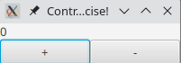

# Esercizio sulle proprietà di JavaFX

Questo esercizio si concentra sull'utilizzo delle properties di JavaFX, una caratteristica chiave del framework. Per approfondimenti, consulta la [documentazione JavaFX](https://docs.oracle.com/javase/8/javafx/api/javafx/beans/property/Property.html).

## Obiettivi dell'Esercizio

### 1. Implementazione di un Counter Osservabile
L'obiettivo è completare l'implementazione della classe `Counter`, che è già parzialmente implementata.

**Compiti:**
- Esamina la classe `Counter` esistente.
- Implementa i metodi `increment()` e `decrement()`, utilizzando le API di JavaFX.

  **Nota Importante:**
  - L'uso diretto di `property.add(1)` non è efficace poiché restituisce una nuova property senza modificare quella esistente. Per incrementare o decrementare il valore correttamente, utilizza `property.set(property.get() + 1)` o una logica equivalente per `decrement()`.

### 2. Strutturazione della GUI
L'obiettivo è sviluppare l'interfaccia grafica (GUI) nella classe `App`, che è parzialmente completata.

**Compiti:**
- Esamina la classe `App` esistente.
- Struttura una GUI che corrisponda all'aspetto mostrato nell'immagine di esempio fornita:
- 
- Implementa le funzionalità per i pulsanti `+` e `-` in modo che possano rispettivamente incrementare e decrementare il valore del contatore.
  - Utilizza il metodo `setOnAction` per associare un'azione al click di ciascun pulsante, modificando così il valore del contatore.
  - **Nota Importante:** Imposta la dimensione minima dei pulsanti a 100 pixel usando `setMinWidth(100)`.
- Assicurati che il testo visualizzi il valore corrente del contatore.
  - Utilizza il metodo `bind` per collegare il testo alla property del contatore.
