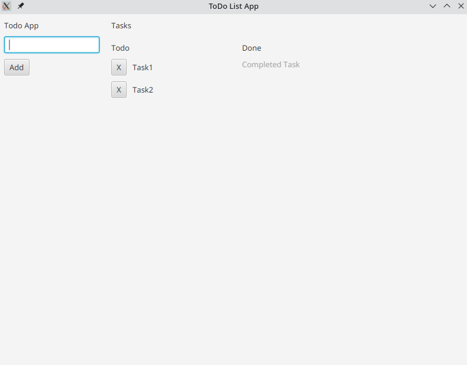

# Esercizio sull'utilizzo dei layout in JavaFX

Questo esercizio ha lo scopo di sviluppare una comprensione pratica dei layout in JavaFX, creando un'interfaccia grafica (GUI) per un'applicazione. 
L'obiettivo è realizzare una GUI che corrisponda all'aspetto mostrato nell'immagine di esempio. 
L'esercizio si concentra esclusivamente sulla struttura della GUI, senza implementare la logica di business, che sarà affrontata in seguito.

## Fasi per la realizzazione della GUI

### Analisi dei componenti necessari
- Esaminare attentamente l'immagine fornita per identificare i componenti necessari alla creazione della GUI.

### Sviluppo della parte sinistra
- La parte sinistra della GUI deve includere:
  - Un titolo.
  - Un campo di testo.
  - Un pulsante.
  - **Nota:** Utilizzare il metodo `setAlignment` con la costante `Pos.TOP_CENTER` per centrare questi elementi come mostrato nell'immagine.

### Sviluppo della parte destra
- La parte destra è un contenitore verticale (`VBox`) che a sua volta contiene:
  - Un'intestazione con il testo "Tasks".
  - Un contenitore orizzontale (`HBox`) che ospita le due colonne "Todo" e "Done".
  
#### Colonna "Todo"
- La colonna "Todo" è un `VBox` che contiene:
  - Un'etichetta con il testo "Todo".
  - Una serie di task da completare.
- **Suggerimento:** Per creare ciascun task nella lista "Todo", si consiglia di utilizzare un metodo helper (es. `createTaskSection`). Questo metodo dovrebbe prendere una stringa come parametro e restituire il `Node` (`HBox`) che rappresenta il singolo task. Tale approccio migliora la modularità e la leggibilità del codice e potrà essere riutilizzato anche per la colonna "Done".

#### Colonna "Done"
- Anche la colonna "Done" è un `VBox` e contiene:
  - Un'etichetta con il testo "Done".
  - I task completati (che sono settati come disabilitati)

**Note importanti:**
- Utilizzare i metodi `setSpacing` e `setPadding` per gestire gli spazi tra i componenti e i margini interni dei layout.
- Assicurarsi che tutti i componenti siano ben allineati e distribuiti come mostrato nell'immagine di esempio.