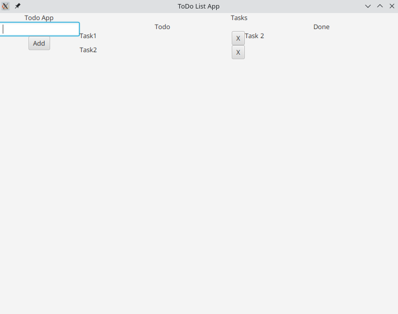

# Esercizio sull'Uso dei Layout in JavaFX

Questo esercizio mira a sviluppare una comprensione pratica dei layout in JavaFX, creando una interfaccia grafica (GUI) per un'applicazione. L'obiettivo è realizzare una GUI che corrisponda all'aspetto mostrato nell'immagine di esempio. Si concentrerà esclusivamente sulla struttura della GUI senza sviluppare la logica di business, che sarà affrontata in un esercizio successivo.

## Passaggi per la Realizzazione della GUI

### Analisi dei Componenti Necessari
- Esamina attentamente l'immagine fornita per identificare i componenti necessari alla creazione della GUI.

### Sviluppo del Lato Sinistro
- Il lato sinistro della GUI deve includere:
  - Un titolo.
  - Un campo di testo.
  - Un pulsante.
  - **Nota:** Utilizza il metodo `setAlignment` con la costante `Pos.TOP_CENTER` per centrare questi elementi come mostrato nell'immagine.

### Sviluppo del Lato Destro
- Il lato destro della GUI deve comprendere:
  - Un titolo.
  - Un'area centrale divisa in due parti:
    - Parte sinistra: visualizza i task completati.
    - Parte destra: elenca i task da completare.
  - **Nota:** Impiega il metodo `setHgrow` con la costante `Priority.ALWAYS` per assicurare che le due parti occupino lo stesso spazio.

### Aggiunta di Stile alla GUI
- Esplora e applica il file di stile fornito per migliorare l'aspetto della GUI: [style.css](./without-style.png).
- Ci sono due file di stile: uno per il tema generale e uno specifico per questa applicazione.
- Modifica il codice aggiungendo classi CSS e identificatori appropriati, facendo riferimento ai file di stile.
  - Ad esempio, per i titoli, puoi usare le classi `title-1`, `title-2`, `title-3`.
